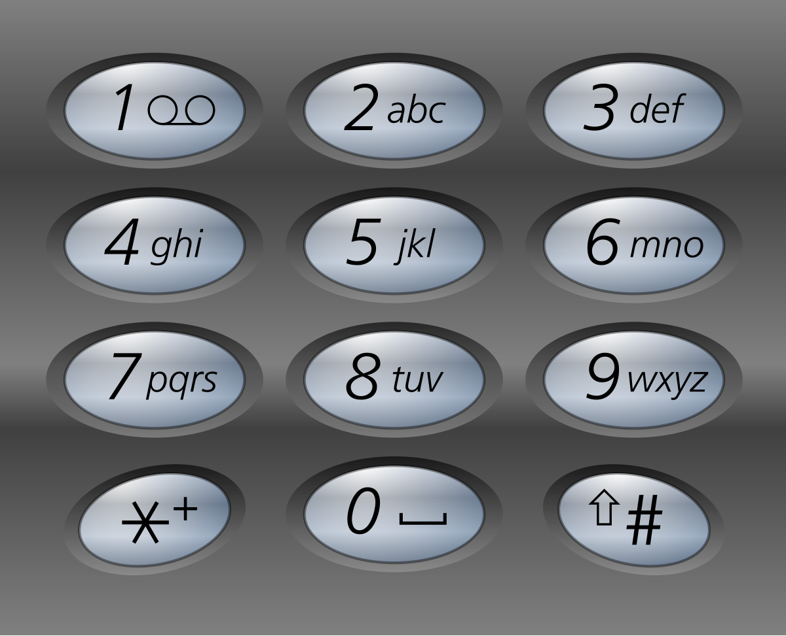
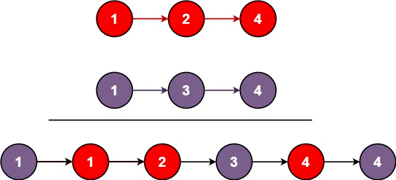

= LeetCode
:toc:
:toc: left

== 1. Two Sum

Given an array of integers `nums` and an integer `target`, return indices of the two numbers such that they add up to `target`.

You may assume that each input would have exactly one solution, and you may not use the same element twice.

You can return the answer in any order.

Example 1:
[source,text]

----
Input: nums = [2,7,11,15], target = 9
Output: [0,1]
Explanation: Because nums[0] + nums[1] == 9, we return [0, 1].
----

Example 2:
[source,text]

----
Input: nums = [3,2,4], target = 6
Output: [1,2]
----

Example 3:
[source,text]

----
Input: nums = [3,3], target = 6
Output: [0,1]
----

=== Solution

[source,java]
----
public class Solution {
    public int[] twoSum(int[] nums, int target) {
        Map<Integer, Integer> complements = new HashMap<>();
        for (int i = 0; i < nums.length; i++) {
            Integer complementIndex = complements.get(nums[i]);
            if (complementIndex != null) {
                return new int[]{complementIndex, i};
            }
            complements.put(target - nums[i], i);
        }
        return nums;
    }
}
----

== 2. Add Two Numbers

You are given two non-empty linked lists representing two non-negative integers.
The digits are stored in reverse order, and each of their nodes contains a single digit.
Add the two numbers and return the sum as a linked list.

You may assume the two numbers do not contain any leading zero, except the number 0 itself.

Example 1:
[source,text]

----
Input: l1 = [2,4,3], l2 = [5,6,4]
Output: [7,0,8]
Explanation: 342 + 465 = 807
----

Example 2:
[source,text]

----
Input: l1 = [0], l2 = [0]
Output: [0]
----

Example 3:
[source,text]

----
Input: l1 = [9,9,9,9,9,9,9], l2 = [9,9,9,9]
Output: [8,9,9,9,0,0,0,1]
----

=== Solution

[source,java]
----
public class Solution {
    public ListNode addTwoNumbers(ListNode l1, ListNode l2) {
        ListNode root = new ListNode(0);
        ListNode node = root;
        int sum = 0;
        while (l1 != null || l2 != null || sum != 0) {
            if (l1 != null) {
                sum = sum + l1.val;
                l1 = l1.next;
            }
            if (l2 != null) {
                sum = sum + l2.val;
                l2 = l2.next;
            }
            node.next = new ListNode(sum % 10);
            sum = sum / 10;
            node = node.next;
        }
        return root.next;
    }
}

class ListNode {
    int val;
    ListNode next;

    ListNode() {
    }

    ListNode(int val) {
        this.val = val;
    }

    ListNode(int val, ListNode next) {
        this.val = val;
        this.next = next;
    }

    @Override
    public boolean equals(Object o) {
        if (this == o) return true;
        if (o == null || getClass() != o.getClass()) return false;
        ListNode listNode = (ListNode) o;
        return val == listNode.val && Objects.equals(next, listNode.next);
    }

    @Override
    public int hashCode() {
        return Objects.hash(val, next);
    }
}
----

== 3. Longest Substring Without Repeating Characters

Given a string `s`, find the length of the longest substring without repeating characters.

Example 1:
[source,text]

----
Input: s = "abcabcbb"
Output: 3
Explanation: The answer is "abc", with the length of 3.
----

Example 2:
[source,text]

----
Input: s = "bbbbb"
Output: 1
Explanation: The answer is "b", with the length of 1.
----

Example 3:
[source,text]

----
Input: s = "pwwkew"
Output: 3
Explanation: The answer is "wke", with the length of 3.
----

Notice that the answer must be a substring, "*pwke*" is a subsequence and not a substring.

=== Solution

[source,java]
----
public class Solution {
    public int lengthOfLongestSubstring(String s) {
        Map<Character, Integer> map = new HashMap<>();
        int maxLength = 0;
        int start = 0;
        for (int end = 0; end < s.length(); end++) {
            if (map.containsKey(s.charAt(end))) {
                start = Math.max(start, map.get(s.charAt(end)) + 1);
            }
            map.put(s.charAt(end), end);
            maxLength = Math.max(maxLength, end - start + 1);
        }
        return maxLength;
    }
}
----

== 4. Median of Two Sorted Arrays

Given two sorted arrays `nums1` and `nums2` of size `m` and `n` respectively, return the median of the two sorted arrays.

The overall run time complexity should be `O(log (m+n))`.

Example 1:
[source,text]

----
Input: nums1 = [1,3], nums2 = [2]
Output: 2.00000
Explanation: merged array = [1,2,3] and median is 2.
----

Example 2:
[source,text]

----
Input: nums1 = [1,2], nums2 = [3,4]
Output: 2.50000
Explanation: merged array = [1,2,3,4] and median is (2 + 3) / 2 = 2.5.
----

=== Solution

[source,java]
----
public class Solution {
    public double findMedianSortedArrays(int[] nums1, int[] nums2) {
        int[] result = IntStream.concat(Arrays.stream(nums1), Arrays.stream(nums2))
                .sorted()
                .toArray();

        return result.length % 2 == 0
                ? (result[(result.length / 2)] + result[result.length / 2 - 1]) / 2.0
                : result[(result.length - 1) / 2];
    }
}
----

== 5. Longest Palindromic Substring

Given a string `s`, return the longest palindromic substring in `s`.

Example 1:
[source,text]

----
Input: s = "babad"
Output: "bab"
Explanation: "aba" is also a valid answer.
----

Example 2:
[source,text]

----
Input: s = "cbbd"
Output: "bb"
----

=== Solution

[source,java]
----
public class Solution {
    public String longestPalindrome(String s) {
        String longest = s.substring(0, 1);
        for (int i = 0; i < s.length(); i++) {
            String palindrome = getString(s, i, i);
            if (palindrome.length() > longest.length()) {
                longest = palindrome;
            }
            palindrome = getString(s, i, i + 1);
            if (palindrome.length() > longest.length()) {
                longest = palindrome;
            }
        }
        return longest;
    }

    private String getString(String s, int left, int right) {
        while (left >= 0 && right < s.length() && s.charAt(left) == s.charAt(right)) {
            left--;
            right++;
        }
        return s.substring(left + 1, right);
    }
}
----

== 7. Reverse Integer

Given a signed 32-bit integer `x`, return `x` with its digits reversed.
If reversing `x` causes the value to go outside the signed 32-bit integer range `[-231, 231 - 1]`, then return 0.

Assume the environment does not allow you to store 64-bit integers (signed or unsigned).

Example 1:
[source,text]

----
Input: x = 123
Output: 321
----

Example 2:
[source,text]

----
Input: x = -123
Output: -321
----

Example 3:
[source,text]

----
Input: x = 120
Output: 21
----

Example 4:
[source,text]

----
Input: x = 1534236469
Output: 0
----

=== Solution

[source,java]
----
public class Solution {
    public int reverse(int x) {
        int iter = x < 0 ? x * -1 : x;
        long result = 0;

        while (iter > 0) {
            result = result * 10 + iter % 10;
            iter = iter / 10;
        }

        if (result > Integer.MAX_VALUE) {
            return 0;
        }

        return x < 0 ? (int) result * -1 : (int) result;
    }
}
----

== 8. String to Integer (atoi)

Implement the myAtoi(string s) function, which converts a string to a 32-bit signed integer (similar to C/C++'s atoi function).

The algorithm for myAtoi(string s) is as follows:

. Read in and ignore any leading whitespace.
. Check if the next character (if not already at the end of the string) is `-` or `+`.
Read this character in if it is either.
This determines if the final result is negative or positive respectively.
Assume the result is positive if neither is present.
. Read in next the characters until the next non-digit character or the end of the input is reached.
The rest of the string is ignored.
. Convert these digits into an integer (i.e. `"123" -> 123`, `"0032" -> 32`).
If no digits were read, then the integer is 0. Change the sign as necessary (from step 2).
. If the integer is out of the 32-bit signed integer range `[-2e31, 2e31 - 1]`, then clamp the integer so that it remains in the range.
Specifically, integers less than `-2e31` should be clamped to `-2e31`, and integers greater than `2e31 - 1` should be clamped to `2e31 - 1`.
. Return the integer as the final result.

Note:

* Only the space character `' '` is considered a whitespace character.
* Do not ignore any characters other than the leading whitespace or the rest of the string after the digits.

Example 1:
[source,text]

----
Input: s = "42"
Output: 42
Explanation: The underlined characters are what is read in, the caret is the current reader position.
Step 1: "42" (no characters read because there is no leading whitespace)
Step 2: "42" (no characters read because there is neither a '-' nor '+')
Step 3: "42" ("42" is read in)
The parsed integer is 42.
Since 42 is in the range [-2e31, 2e31 - 1], the final result is 42.
----

Example 2:
[source,text]

----
Input: s = "   -42"
Output: -42
Explanation:
Step 1: "   -42" (leading whitespace is read and ignored)
Step 2: "   -42" ('-' is read, so the result should be negative)
Step 3: "   -42" ("42" is read in)
The parsed integer is -42.
Since -42 is in the range [-23e1, 2e31 - 1], the final result is -42.
----

Example 3:
[source,text]

----
Input: s = "4193 with words"
Output: 4193
Explanation:
Step 1: "4193 with words" (no characters read because there is no leading whitespace)
Step 2: "4193 with words" (no characters read because there is neither a '-' nor '+')
Step 3: "4193 with words" ("4193" is read in; reading stops because the next character is a non-digit)
The parsed integer is 4193.
Since 4193 is in the range [-2e31, 2e31 - 1], the final result is 4193.
----

=== Solution

[source,java]
----
public class Solution {
    public int myAtoi(String s) {
        if (s == null || s.trim().isEmpty()) {
            return 0;
        }
        int i = 0;
        int result = 0;
        int sign = 1;
        s = s.trim();
        if (s.charAt(i) == '-') {
            sign = -1;
            i++;
        } else if (s.charAt(i) == '+') {
            i++;
        }
        while (i < s.length() && Character.isDigit(s.charAt(i))) {
            int d = Integer.parseInt(String.valueOf(s.charAt(i)));
            if (result > (Integer.MAX_VALUE - d) / 10) {
                return sign > 0 ? Integer.MAX_VALUE : Integer.MIN_VALUE;
            }
            result = result * 10 + d;
            i++;
        }
        return result * sign;
    }
}
----

== 9. Palindrome Number

Given an integer `x`, return `true` if `x` is a *palindrome*, and `false` otherwise.

Example 1:
[source,text]

----
Input: x = 121
Output: true
Explanation: 121 reads as 121 from left to right and from right to left.
----

Example 2:
[source,text]

----
Input: x = -121
Output: false
Explanation: From left to right, it reads -121. From right to left, it becomes 121-. Therefore it is not a palindrome.
----

Example 3:
[source,text]

----
Input: x = 10
Output: false
Explanation: Reads 01 from right to left. Therefore it is not a palindrome.
----

=== Solution

[source,java]
----
public class Solution {
    public boolean isPalindrome(int x) {
        if (x == 0) {
            return true;
        }
        if (x < 0 || x % 10 == 0) {
            return false;
        }
        int result = 0;
        while (result < x) {
            result = result * 10 + x % 10;
            x = x / 10;
        }
        return result == x || result / 10 == x;
    }
}
----

== 11. Container With Most Water

You are given an integer array height of length `n`.
There are `n` vertical lines drawn such that the two endpoints of the stem:[i^{th}] line are (`i, 0`) and (`i, height[i]`).

Find two lines that together with the x-axis form a container, such that the container contains the most water.

Return the maximum amount of water a container can store.

Notice that you may not slant the container.

Example 1:
[source,text]

----
Input: height = [1,8,6,2,5,4,8,3,7]
Output: 49
Explanation: The above vertical lines are represented by array [1,8,6,2,5,4,8,3,7]. In this case, the max area of water (blue section) the container can contain is 49.
----

image::src/main/resources/images/task11.png[]

Example 2:
[source,text]

----
Input: height = [1,1]
Output: 1
----

=== Solution

[source,java]
----
public class Solution {
    public int maxArea(int[] height) {
        int maxArea = 0;
        int left = 0;
        int right = height.length - 1;
        while (left < right) {
            int leftHeight = height[left];
            int rightHeight = height[right];
            int tempArea = (right - left) * min(leftHeight, rightHeight);
            maxArea = max(maxArea, tempArea);
            if (leftHeight > rightHeight) {
                right--;
            } else if (leftHeight < rightHeight) {
                left++;
            } else {
                left++;
                right--;
            }
        }
        return maxArea;
    }
}
----

== 12. Integer to Roman

Roman numerals are represented by seven different symbols: `I`, `V`, `X`, `L`, `C`, `D` and `M`.

[source,text]
----
Symbol       Value
I             1
V             5
X             10
L             50
C             100
D             500
M             1000
----

For example, `2` is written as `II` in Roman numeral, just two one's added together. `12` is written as `XII`, which is simply `X + II`.
The number `27` is written as `XXVII`, which is `XX + V + II`.

Roman numerals are usually written largest to smallest from left to right.
However, the numeral for four is not `IIII`.
Instead, the number four is written as `IV`.
Because the one is before the five we subtract it making four.
The same principle applies to the number nine, which is written as `IX`.

There are six instances where subtraction is used:

* `I` can be placed before `V` (5) and `X` (10) to make `4` and `9`.
* `X` can be placed before `L` (50) and `C` (100) to make `40` and `90`.
* `C` can be placed before `D` (500) and `M` (1000) to make `400` and `900`.

Given an integer, convert it to a roman numeral.

Example 1:

[source,text]
----
Input: num = 3
Output: "III"
Explanation: 3 is represented as 3 ones.
----

Example 2:

[source,text]
----
Input: num = 58
Output: "LVIII"
Explanation: L = 50, V = 5, III = 3.
----

Example 3:

[source,text]
----
Input: num = 1994
Output: "MCMXCIV"
Explanation: M = 1000, CM = 900, XC = 90 and IV = 4.
----

=== Solution

[source,java]
----
public class Solution {
    private final static int[] val = {1000, 900, 500, 400, 100, 90, 50, 40, 10, 9, 5, 4, 1};
    private final static String[] rom = {"M", "CM", "D", "CD", "C", "XC", "L", "XL", "X", "IX", "V", "IV", "I"};

    public String intToRoman(int num) {
        StringBuilder result = new StringBuilder();
        for (int i = 0; num > 0; i++) {
            while (num >= val[i]) {
                result.append(rom[i]);
                num -= val[i];
            }
        }
        return result.toString();
    }
}
----

== 13. Roman to Integer

Roman numerals are represented by seven different symbols: `I`, `V`, `X`, `L`, `C`, `D` and `M`.

[source,text]
----
Symbol       Value
I             1
V             5
X             10
L             50
C             100
D             500
M             1000
----

For example, `2` is written as `II` in Roman numeral, just two one's added together. `12` is written as `XII`, which is simply `X + II`.
The number `27` is written as `XXVII`, which is `XX + V + II`.

Roman numerals are usually written largest to smallest from left to right.
However, the numeral for four is not `IIII`.
Instead, the number four is written as `IV`.
Because the one is before the five we subtract it making four.
The same principle applies to the number nine, which is written as `IX`.

There are six instances where subtraction is used:

* `I` can be placed before `V` (5) and `X` (10) to make `4` and `9`.
* `X` can be placed before `L` (50) and `C` (100) to make `40` and `90`.
* `C` can be placed before `D` (500) and `M` (1000) to make `400` and `900`.

Given a roman numeral, convert it to an integer.

Example 1:

[source,text]
----
Input: s = "III"
Output: 3
Explanation: III = 3.
----

Example 2:

[source,text]
----
Input: s = "LVIII"
Output: 58
Explanation: L = 50, V= 5, III = 3.
----

Example 3:

[source,text]
----
Input: s = "MCMXCIV"
Output: 1994
Explanation: M = 1000, CM = 900, XC = 90 and IV = 4.
----

=== Solution

[source,java]
----
public class Solution {
    private final static Map<Character, Integer> map = new HashMap<>(Map.of(
            'I', 1,
            'V', 5,
            'X', 10,
            'L', 50,
            'C', 100,
            'D', 500,
            'M', 1000
    ));

    public int romanToInt(String s) {
        int result = 0;
        for (int i = 0; i < s.length(); i++) {
            if (i != s.length() - 1) {
                if (map.get(s.charAt(i)) >= map.get(s.charAt(i + 1))) {
                    result += map.get(s.charAt(i));
                } else {
                    result += map.get(s.charAt(i + 1)) - map.get(s.charAt(i));
                    i++;
                }
            } else {
                result += map.get(s.charAt(i));
            }
        }
        return result;
    }
}
----

== 14. Longest Common Prefix

Write a function to find the longest common prefix string amongst an array of strings.

If there is no common prefix, return an empty string `""`.

Example 1:
[source,text]

----
Input: strs = ["flower","flow","flight"]
Output: "fl"
----

Example 2:
[source,text]

----
Input: strs = ["dog","racecar","car"]
Output: ""
Explanation: There is no common prefix among the input strings.
----

=== Solution

[source,java]
----
public class Solution {
    public String longestCommonPrefix(String[] strs) {
        if (strs == null || strs.length == 0) {
            return "";
        }
        Arrays.sort(strs);
        String first = strs[0];
        String last = strs[strs.length - 1];
        int counter = 0;
        while (counter < first.length()) {
            if (first.charAt(counter) != last.charAt(counter)) {
                break;
            }
            counter++;
        }
        return counter == 0 ? "" : first.substring(0, counter);
    }
}
----

== 15. 3Sum

Given an integer array nums, return all the triplets `[nums[i], nums[j], nums[k]]` such that `i != j`, `i != k`, and `j != k`, and `nums[i] + nums[j] + nums[k] == 0`.

Notice that the solution set must not contain duplicate triplets.

Example 1:
[source,text]

----
Input: nums = [-1,0,1,2,-1,-4]
Output: [[-1,-1,2],[-1,0,1]]
Explanation:
nums[0] + nums[1] + nums[2] = (-1) + 0 + 1 = 0.
nums[1] + nums[2] + nums[4] = 0 + 1 + (-1) = 0.
nums[0] + nums[3] + nums[4] = (-1) + 2 + (-1) = 0.
The distinct triplets are [-1,0,1] and [-1,-1,2].
Notice that the order of the output and the order of the triplets does not matter.
----

Example 2:
[source,text]

----
Input: nums = [0,1,1]
Output: []
Explanation: The only possible triplet does not sum up to 0.
----

Example 3:
[source,text]

----
Input: nums = [0,0,0]
Output: [[0,0,0]]
Explanation: The only possible triplet sums up to 0.
----

=== Solution

[source,java]
----
public class Solution {
    public List<List<Integer>> threeSum(int[] nums) {
        Arrays.sort(nums);
        Set<List<Integer>> result = new HashSet<>();
        for (int i = 0; i < nums.length - 2; i++) {
            int j = i + 1;
            int k = nums.length - 1;
            while (j < k) {
                int sum = nums[i] + nums[j] + nums[k];
                if (sum == 0) {
                    List<Integer> temp = new ArrayList<>(List.of(nums[i], nums[j], nums[k]));
                    Collections.sort(temp);
                    result.add(temp);
                    while (j < k && nums[j] == nums[j + 1]) {
                        j++;
                    }
                    while (j < k && nums[k] == nums[k - 1]) {
                        k--;
                    }
                    j++;
                    k--;
                } else if (sum < 0) {
                    j++;
                } else {
                    k--;
                }
            }
        }
        return new ArrayList<>(result);
    }
}
----

== 16. 3Sum Closest

Given an integer array `nums` of length `n` and an integer `target`, find three integers in `nums` such that the sum is closest to `target`.

Return the sum of the three integers.

You may assume that each input would have exactly one solution.

Example 1:
[source,text]

----
Input: nums = [-1,2,1,-4], target = 1
Output: 2
Explanation: The sum that is closest to the target is 2. (-1 + 2 + 1 = 2).
----

Example 2:
[source,text]

----
Input: nums = [0,0,0], target = 1
Output: 0
Explanation: The sum that is closest to the target is 0. (0 + 0 + 0 = 0).
----

=== Solution

[source,java]
----
public class Solution {
    public int threeSumClosest(int[] nums, int target) {
        if (nums.length == 3) {
            return nums[0] + nums[1] + nums[2];
        }
        Arrays.sort(nums);
        int result = Math.abs(nums[0] + nums[1] + nums[nums.length - 1]);
        int temp = Math.abs(result - target);
        for (int i = 0; i < nums.length - 2; i++) {
            int j = i + 1;
            int k = nums.length - 1;
            while (j < k) {
                int sum = nums[i] + nums[j] + nums[k];
                if (sum == target) {
                    return sum;
                }
                if (temp > Math.abs(sum - target)) {
                    temp = Math.abs(sum - target);
                    result = sum;
                }
                if (sum > target) {
                    k--;
                } else {
                    j++;
                }
            }
        }
        return result;
    }
}
----

== 17. Letter Combinations of a Phone Number

Given a string containing digits from `2-9` inclusive, return all possible letter combinations that the number could represent.
Return the answer in any order.

A mapping of digits to letters (just like on the telephone buttons) is given below.
Note that `1` does not map to any letters.

Example 1:
[source,text]

----
Input: digits = "23"
Output: ["ad","ae","af","bd","be","bf","cd","ce","cf"]
----

Example 2:
[source,text]

----
Input: digits = ""
Output: []
----

Example 3:
[source,text]

----
Input: digits = "2"
Output: ["a","b","c"]
----

=== Solution

[source,java]
----
class Solution {
    Map<Character, String> map = new HashMap<>(
            Map.of(
                    '0', "",
                    '1', "",
                    '2', "abc",
                    '3', "def",
                    '4', "ghi",
                    '5', "jkl",
                    '6', "mno",
                    '7', "pqrs",
                    '8', "tuv",
                    '9', "wxyz"
            )
    );

    public List<String> letterCombinations(String digits) {
        if (digits == null || digits.length() == 0) {
            return List.of();
        }
        List<String> result = new ArrayList<>();
        solve(digits, map, result, 0, "");
        return result;
    }

    private static void solve(String digits, Map<Character, String> map, List<String> result, int index, String res) {
        if (index == digits.length()) {
            result.add(res);
            return;
        }
        String temp = map.get(digits.charAt(index));
        for (int i = 0; i < temp.length(); i++) {
            String newTemp = res + temp.charAt(i);
            solve(digits, map, result, index + 1, newTemp);
        }
    }
}
----

== 18. 4Sum

Given an array `nums` of `n` integers, return an array of all the unique quadruplets `[nums[a], nums[b], nums[c], nums[d]]` such that:

* `0 <= a, b, c, d < n`
* `a`, `b`, `c`, and `d` are *distinct*.
* `nums[a] + nums[b] + nums[c] + nums[d] == target`

You may return the answer in any order.

Example 1:
[source,text]

----
Input: nums = [1,0,-1,0,-2,2], target = 0
Output: [[-2,-1,1,2],[-2,0,0,2],[-1,0,0,1]]
----

Example 2:
[source,text]

----
Input: nums = [2,2,2,2,2], target = 8
Output: [[2,2,2,2]]
----

=== Solution

[source,java]
----
class Solution {
    public List<List<Integer>> fourSum(int[] nums, int target) {
        Arrays.sort(nums);
        List<List<Integer>> result = new ArrayList<>();
        for (int i = 0; i < nums.length; i++) {
            if (i > 0 && nums[i] == nums[i - 1]) {
                continue;
            }
            for (int j = i + 1; j < nums.length - 1; j++) {
                if (j > i + 1 && nums[j] == nums[j - 1]) {
                    continue;
                }
                int k = j + 1;
                int l = nums.length - 1;
                while (k < l) {
                    long temp = (long) nums[i] + (long) nums[j] + (long) nums[k] + (long) nums[l];
                    if (temp > Integer.MAX_VALUE) {
                        k++;
                        continue;
                    }
                    if (temp < Integer.MIN_VALUE) {
                        l--;
                        continue;
                    }
                    if (temp == target) {
                        result.add(List.of(nums[i], nums[j], nums[k], nums[l]));
                        while (k < l && nums[k] == nums[k + 1]) {
                            k++;
                        }
                        while (k < l && nums[l] == nums[l - 1]) {
                            l--;
                        }
                        k++;
                        l--;
                    } else if (temp > target) {
                        l--;
                    } else {
                        k++;
                    }
                }
            }
        }
        return result;
    }
}
----

== 19. Remove Nth Node From End of List

Given the head of a linked list, remove the nth node from the end of the list and return its head.

Example 1:

[source,text]
----
Input: head = [1,2,3,4,5], n = 2
Output: [1,2,3,5]
----

image::src/main/resources/images/task19.png[]

Example 2:

[source,text]
----
Input: head = [1], n = 1
Output: []
----

Example 3:

[source,text]
----
Input: head = [1,2], n = 1
Output: [1]
----

=== Solution

[source,java]
----
public class Solution {
    public ListNode removeNthFromEnd(ListNode head, int n) {
        ListNode resultNode = new ListNode(0);
        ListNode slow = resultNode;
        ListNode fast = resultNode;
        slow.next = head;

        for (int i = 0; i <= n; i++) {
            fast = fast.next;
        }
        while (fast != null) {
            fast = fast.next;
            slow = slow.next;
        }
        slow.next = slow.next.next;

        return resultNode.next;
    }
}

class ListNode {
    int val;
    ListNode next;

    ListNode() {
    }

    ListNode(int val) {
        this.val = val;
    }

    ListNode(int val, ListNode next) {
        this.val = val;
        this.next = next;
    }

    @Override
    public boolean equals(Object o) {
        if (this == o) return true;
        if (o == null || getClass() != o.getClass()) return false;
        ListNode listNode = (ListNode) o;
        return val == listNode.val && Objects.equals(next, listNode.next);
    }

    @Override
    public int hashCode() {
        return Objects.hash(val, next);
    }
}
----

== 20. Valid Parentheses

Given a string s containing just the characters `(,` `)`, `{`, `}`, `[` and `]`, determine if the input string is valid.

An input string is valid if:

. Open brackets must be closed by the same type of brackets.
. Open brackets must be closed in the correct order.
. Every close bracket has a corresponding open bracket of the same type.

Example 1:

[source,text]
----
Input: s = "()"
Output: true
----

Example 2:

[source,text]
----
Input: s = "()[]{}"
Output: true
----

Example 3:

[source,text]
----
Input: s = "(]"
Output: false
----

=== Solution

[source,java]
----
public class Solution {
    Map<Character, Character> map = Map.of(
            ')', '(',
            ']', '[',
            '}', '{'
    );

    public boolean isValid(String s) {
        Stack<Character> stack = new Stack<>();
        for (int i = 0; i < s.length(); i++) {
            if (s.charAt(i) == '(' || s.charAt(i) == '[' || s.charAt(i) == '{') {
                stack.push(s.charAt(i));
                continue;
            }
            if (stack.size() == 0 || map.get(s.charAt(i)) != stack.pop()) {
                return false;
            }
        }
        return stack.size() == 0;
    }
}
----

== 21. Merge Two Sorted Lists

You are given the heads of two sorted linked lists `list1` and `list2`.

Merge the two lists in a one sorted list.
The list should be made by splicing together the nodes of the first two lists.

Return the head of the merged linked list.

Example 1:

[source,text]
----
Input: list1 = [1,2,4], list2 = [1,3,4]
Output: [1,1,2,3,4,4]
----

Example 2:

[source,text]
----
Input: list1 = [], list2 = []
Output: []
----

Example 3:

[source,text]
----
Input: list1 = [], list2 = [0]
Output: [0]
----

=== Solution

[source,java]
----
public class Solution {
    public ListNode mergeTwoLists(ListNode list1, ListNode list2) {
        if (list1 == null) {
            return list2;
        }
        if (list2 == null) {
            return list1;
        }
        if (list1.val < list2.val) {
            list1.next = mergeTwoLists(list1.next, list2);
            return list1;
        } else {
            list2.next = mergeTwoLists(list1, list2.next);
            return list2;
        }
    }
}

class ListNode {
    int val;
    ListNode next;

    ListNode() {
    }

    ListNode(int val) {
        this.val = val;
    }

    ListNode(int val, ListNode next) {
        this.val = val;
        this.next = next;
    }

    @Override
    public boolean equals(Object o) {
        if (this == o) return true;
        if (o == null || getClass() != o.getClass()) return false;
        ListNode listNode = (ListNode) o;
        return val == listNode.val && Objects.equals(next, listNode.next);
    }

    @Override
    public int hashCode() {
        return Objects.hash(val, next);
    }
}
----

== 22. Generate Parentheses

Given `n` pairs of parentheses, write a function to generate all combinations of well-formed parentheses.

Example 1:

[source,text]
----

Input: n = 3
Output: ["((()))","(()())","(())()","()(())","()()()"]
----

Example 2:

[source,text]
----

Input: n = 1
Output: ["()"]
----

=== Solution

[source,java]
----
public class Solution {
    public List<String> generateParenthesis(int n) {
        List<String> result = new ArrayList<>();
        helper(result, "", 0, 0, n);
        return result;
    }

    private void helper(List<String> result, String temp, int open, int close, int n) {
        if (temp.length() == n * 2) {
            result.add(temp);
            return;
        }
        if (open < n) {
            helper(result, temp + "(", open + 1, close, n);
        }
        if (close < open) {
            helper(result, temp + ")", open, close + 1, n);
        }
    }
}
----

== 23. Merge k Sorted Lists

You are given an array of `k` linked-lists `lists`, each linked-list is sorted in ascending order.

Merge all the linked-lists into one sorted linked-list and return it.

Example 1:

[source,text]
----
Input: lists = [[1,4,5],[1,3,4],[2,6]]
Output: [1,1,2,3,4,4,5,6]
Explanation: The linked-lists are:
[
  1->4->5,
  1->3->4,
  2->6
]
merging them into one sorted list:
1->1->2->3->4->4->5->6
----

Example 2:

[source,text]
----
Input: lists = []
Output: []
----

Example 3:

[source,text]
----
Input: lists = [[]]
Output: []
----

=== Solution

[source,java]
----
public class Solution {
    public ListNode mergeKLists(ListNode[] lists) {
        if (lists == null || lists.length == 0) {
            return null;
        }
        PriorityQueue<ListNode> queue = createQueue(lists);
        ListNode result = new ListNode(0);
        ListNode temp = result;
        for (ListNode node : lists) {
            if (node != null) {
                queue.add(node);
            }
        }
        while (!queue.isEmpty()) {
            temp.next = queue.poll();
            temp = temp.next;

            if (temp.next != null) {
                queue.add(temp.next);
            }
        }
        return result.next;
    }

    private PriorityQueue<ListNode> createQueue(ListNode[] lists) {
        return new PriorityQueue<>(lists.length, (o1, o2) -> {
            if (o1.val < o2.val)
                return -1;
            else if (o1.val == o2.val)
                return 0;
            else
                return 1;
        });
    }
}

class ListNode {
    int val;
    ListNode next;

    ListNode() {
    }

    ListNode(int val) {
        this.val = val;
    }

    ListNode(int val, ListNode next) {
        this.val = val;
        this.next = next;
    }

    @Override
    public boolean equals(Object o) {
        if (this == o) return true;
        if (o == null || getClass() != o.getClass()) return false;
        ListNode listNode = (ListNode) o;
        return val == listNode.val && Objects.equals(next, listNode.next);
    }

    @Override
    public int hashCode() {
        return Objects.hash(val, next);
    }
}
----

== 26. Remove Duplicates from Sorted Array

Given an integer array `nums` sorted in non-decreasing order, remove the duplicates in-place such that each unique element appears only once.
The relative order of the elements should be kept the same.

Since it is impossible to change the length of the array in some languages, you must instead have the result be placed in the first part of the array `nums`.
More formally, if there are `k` elements after removing the duplicates, then the first k elements of `nums` should hold the final result.
It does not matter what you leave beyond the first `k` elements.

Return `k` after placing the final result in the first `k` slots of `nums`.

Do not allocate extra space for another array.
You must do this by modifying the input array in-place with O(1) extra memory.

Custom Judge:

The judge will test your solution with the following code:

[source,text]
----
int[] nums = [...]; // Input array
int[] expectedNums = [...]; // The expected answer with correct length

int k = removeDuplicates(nums); // Calls your implementation

assert k == expectedNums.length;
for (int i = 0; i < k; i++) {
assert nums[i] == expectedNums[i];
}
----

If all assertions pass, then your solution will be accepted.

Example 1:

[source,text]
----
Input: nums = [1,1,2]
Output: 2, nums = [1,2,_]
Explanation: Your function should return k = 2, with the first two elements of nums being 1 and 2 respectively.
It does not matter what you leave beyond the returned k (hence they are underscores).
----

Example 2:

[source,text]
----

Input: nums = [0,0,1,1,1,2,2,3,3,4]
Output: 5, nums = [0,1,2,3,4,_,_,_,_,_]
Explanation: Your function should return k = 5, with the first five elements of nums being 0, 1, 2, 3, and 4 respectively.
It does not matter what you leave beyond the returned k (hence they are underscores).
----

=== Solution

[source,java]
----
public class Solution {
    public int removeDuplicates(int[] nums) {
        int temp = nums[0];
        int size = 1;
        for (int i = 1; i < nums.length; i++) {
            if (nums[i] > temp) {
                temp = nums[i];
                nums[size] = temp;
                size++;
            }
        }
        return size;
    }
}
----

== 27. Remove Element

Given an integer array `nums` and an integer `val`, remove all occurrences of `val` in `nums` in-place.
The relative order of the elements may be changed.

Since it is impossible to change the length of the array in some languages, you must instead have the result be placed in the first part of the array `nums`.
More formally, if there are `k` elements after removing the duplicates, then the first `k` elements of `nums` should hold the final result.
It does not matter what you leave beyond the first `k` elements.

Return `k` after placing the final result in the first `k` slots of `nums`.

Do not allocate extra space for another array.
You must do this by modifying the input array in-place with O(1) extra memory.

Custom Judge:

The judge will test your solution with the following code:

[source,text]
----
int[] nums = [...]; // Input array
int val = ...; // Value to remove
int[] expectedNums = [...]; // The expected answer with correct length.
// It is sorted with no values equaling val.

int k = removeElement(nums, val); // Calls your implementation

assert k == expectedNums.length;
sort(nums, 0, k); // Sort the first k elements of nums
for (int i = 0; i < actualLength; i++) {
assert nums[i] == expectedNums[i];
}
----

If all assertions pass, then your solution will be accepted.

Example 1:

[source,text]
----
Input: nums = [3,2,2,3], val = 3
Output: 2, nums = [2,2,_,_]
Explanation: Your function should return k = 2, with the first two elements of nums being 2.
It does not matter what you leave beyond the returned k (hence they are underscores).
----

Example 2:

[source,text]
----
Input: nums = [0,1,2,2,3,0,4,2], val = 2
Output: 5, nums = [0,1,4,0,3,_,_,_]
Explanation: Your function should return k = 5, with the first five elements of nums containing 0, 0, 1, 3, and 4.
Note that the five elements can be returned in any order.
It does not matter what you leave beyond the returned k (hence they are underscores).
----

=== Solution

[source,java]
----
public class Solution {
    public int removeElement(int[] nums, int val) {
        int counter = 0;
        for (int i = 0; i < nums.length; i++) {
            if (nums[i] != val) {
                nums[counter] = nums[i];
                counter++;
            }
        }
        return counter;
    }
}
----

== 28. Find the Index of the First Occurrence in a String

Given two strings `needle` and `haystack`, return the index of the first occurrence of `needle` in `haystack`, or `-1` if `needle` is not part of `haystack`.

Example 1:

[source,text]
----
Input: haystack = "sadbutsad", needle = "sad"
Output: 0
Explanation: "sad" occurs at index 0 and 6.
The first occurrence is at index 0, so we return 0.

----

Example 2:

[source,text]
----
Input: haystack = "leetcode", needle = "leeto"
Output: -1
Explanation: "leeto" did not occur in "leetcode", so we return -1.

----

=== Solution

[source,java]
----
public class Solution {
    public int strStr(String haystack, String needle) {
        int x = haystack.length() - needle.length();
        for (int i = 0; i <= x; i++) {
            if (needle.equals(haystack.substring(i, i + needle.length()))) {
                return i;
            }
        }
        return -1;
    }
}
----

== 29. Divide Two Integers

Given two integers `dividend` and `divisor`, divide two integers without using multiplication, division, and mod operator.

The integer division should truncate toward zero, which means losing its fractional part.
For example, `8.345` would be truncated to `8`, and `-2.7335` would be truncated to `-2`.

Return the quotient after dividing `dividend` by `divisor`.

Note: Assume we are dealing with an environment that could only store integers within the 32-bit signed integer range: `[−2e31, 2e31 − 1]`.
For this problem, if the quotient is strictly greater than `2e31 - 1`, then return `2e31 - 1`, and if the quotient is strictly less than `-2e31`, then return `-2e31`.

Example 1:

[source,text]
----
Input: dividend = 10, divisor = 3
Output: 3
Explanation: 10/3 = 3.33333.. which is truncated to 3.
----

Example 2:

[source,text]
----
Input: dividend = 7, divisor = -3
Output: -2
Explanation: 7/-3 = -2.33333.. which is truncated to -2.
----

=== Solution

[source,java]
----
public class Solution {
    public int divide(int dividend, int divisor) {
        int sign = 1;
        if ((dividend > 0 && divisor < 0) || (dividend < 0 && divisor > 0)) {
            sign = -1;
        }
        long tempResult = divide(Math.abs((long) dividend), Math.abs((long) divisor));
        return tempResult > Integer.MAX_VALUE
                ? sign == 1 ? Integer.MAX_VALUE : Integer.MIN_VALUE
                : (int) (sign * tempResult);
    }

    private long divide(long dividend, long divisor) {
        if (dividend < divisor) {
            return 0;
        }
        long sum = divisor;
        long mult = 1;
        while ((sum * 2) <= dividend) {
            sum += sum;
            mult += mult;
        }
        return mult + divide(dividend - sum, divisor);
    }
}
----

== 30. Substring with Concatenation of All Words

You are given a string `s` and an array of strings `words`.
All the strings of `words` are of the same length.

A concatenated substring in `s` is a substring that contains all the strings of any permutation of `words` concatenated.

* For example, if `words = ["ab","cd","ef"]`, then `"abcdef"`, `"abefcd"`, `"cdabef"`, `"cdefab"`, `"efabcd"`, and `"efcdab"` are all concatenated strings. `"acdbef"` is not a concatenated substring because it is not the concatenation of any permutation of `words`.

Return the starting indices of all the concatenated substrings in `s`.
You can return the answer in any order.

Example 1:

[source,text]
----
Input: s = "barfoothefoobarman", words = ["foo","bar"]
Output: [0,9]
Explanation: Since words.length == 2 and words[i].length == 3, the concatenated substring has to be of length 6.
The substring starting at 0 is "barfoo". It is the concatenation of ["bar","foo"] which is a permutation of words.
The substring starting at 9 is "foobar". It is the concatenation of ["foo","bar"] which is a permutation of words.
The output order does not matter. Returning [9,0] is fine too.
----

Example 2:

[source,text]
----
Input: s = "wordgoodgoodgoodbestword", words = ["word","good","best","word"]
Output: []
Explanation: Since words.length == 4 and words[i].length == 4, the concatenated substring has to be of length 16.
There is no substring of length 16 is s that is equal to the concatenation of any permutation of words.
We return an empty array.
----

Example 3:

[source,text]
----
Input: s = "barfoofoobarthefoobarman", words = ["bar","foo","the"]
Output: [6,9,12]
Explanation: Since words.length == 3 and words[i].length == 3, the concatenated substring has to be of length 9.
The substring starting at 6 is "foobarthe". It is the concatenation of ["foo","bar","the"] which is a permutation of words.
The substring starting at 9 is "barthefoo". It is the concatenation of ["bar","the","foo"] which is a permutation of words.
The substring starting at 12 is "thefoobar". It is the concatenation of ["the","foo","bar"] which is a permutation of words.
----

=== Solution

[source,java]
----
public class Solution {
    public List<Integer> findSubstring(String s, String[] words) {
        Map<String, Integer> counts = new HashMap<>();
        for (String word : words) {
            int count = counts.getOrDefault(word, 0) + 1;
            counts.put(word, count);
        }
        List<Integer> result = new ArrayList<>();
        int n = s.length();
        int num = words.length;
        int len = words[0].length();
        for (int i = 0; i < n - num * len + 1; i++) {
            Map<String, Integer> copy = new HashMap<>();
            int temp = 0;
            while (temp < num) {
                String word = s.substring(i + temp * len, i + (temp + 1) * len);
                if (counts.containsKey(word)) {
                    copy.put(word, copy.getOrDefault(word, 0) + 1);
                    if (copy.get(word) > counts.getOrDefault(word, 0)) {
                        break;
                    }
                } else {
                    break;
                }
                temp++;
            }
            if (temp == num) {
                result.add(i);
            }
        }
        return result;
    }
}
----

== 33. Search in Rotated Sorted Array

There is an integer array `nums` sorted in ascending order (with distinct values).

Prior to being passed to your function, `nums` is possibly rotated at an unknown pivot index `k` (`1 <= k < nums.length`) such that the resulting array is `[nums[k], nums[k+1], ..., nums[n-1], nums[0], nums[1], ..., nums[k-1]]` (0-indexed).
For example, `[0,1,2,4,5,6,7]` might be rotated at pivot index `3` and become `[4,5,6,7,0,1,2]`.

Given the array `nums` after the possible rotation and an integer `target`, return the index of `target` if it is in `nums`, or `-1` if it is not in `nums`.

You must write an algorithm with `O(log n)` runtime complexity.

Example 1:

[source,text]
----
Input: nums = [4,5,6,7,0,1,2], target = 0
Output: 4
----

Example 2:

[source,text]
----
Input: nums = [4,5,6,7,0,1,2], target = 3
Output: -1
----

Example 3:

[source,text]
----
Input: nums = [1], target = 0
Output: -1
----

=== Solution

[source,java]
----
public class Solution {
    public int search(int[] nums, int target) {
        int start = 0;
        int end = nums.length - 1;
        while (start < end) {
            int mid = (start + end) / 2;
            if (nums[mid] == target) {
                return mid;
            }
            if (nums[start] <= nums[mid]) {
                if (target >= nums[start] && target < nums[mid]) {
                    end = mid - 1;
                } else {
                    start = mid + 1;
                }
            } else {
                if (target > nums[mid] && target <= nums[end]) {
                    start = mid + 1;
                } else {
                    end = mid - 1;
                }
            }
        }
        return nums[start] == target ? start : -1;
    }
}
----
